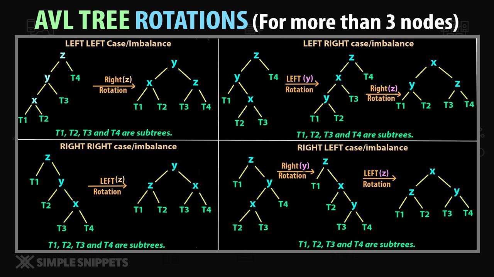
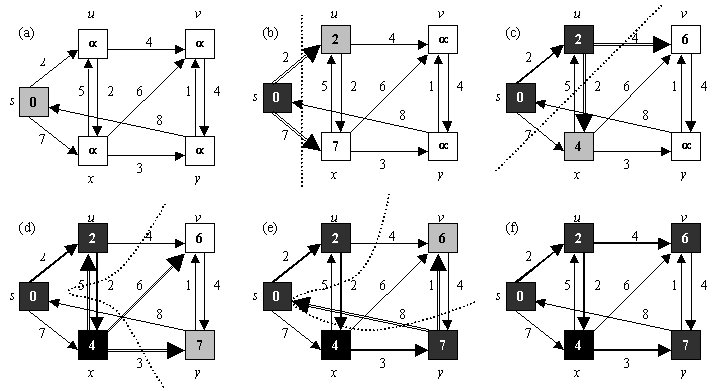
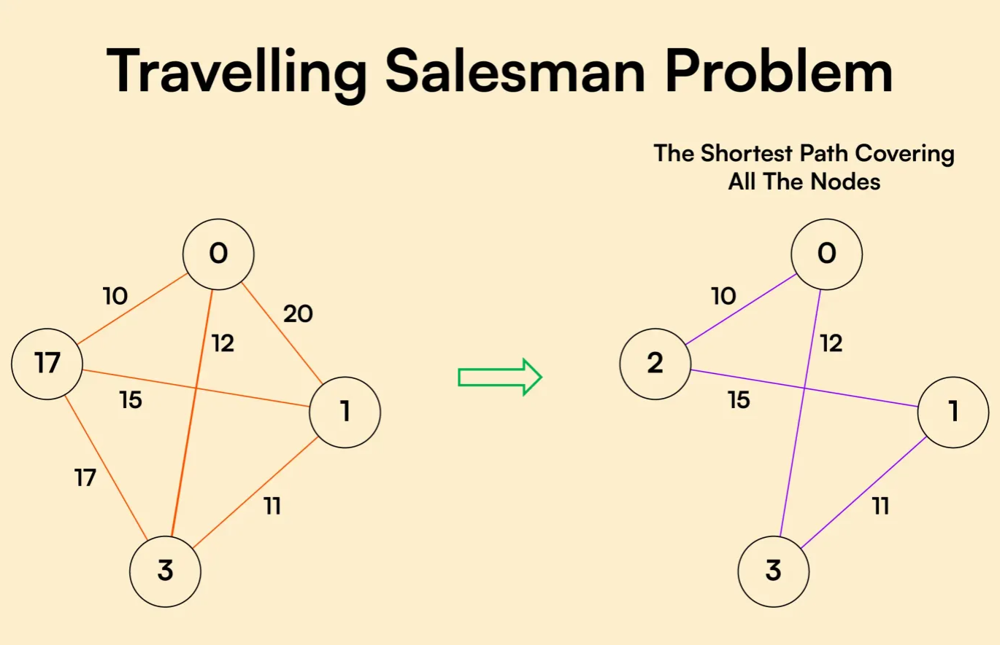

# Algorithms and Interview Preparation

This repository contains my personal studies and implementations of classic algorithms and data structures, designed to help me (and others) prepare for technical interviews and deepen understanding of computer science fundamentals.

## Contents

- **AVL Tree (Python):**  
  An advanced implementation of AVL trees, a self-balancing binary search tree, written in Python. This code demonstrates insertion, deletion, and balancing operations, with comments and examples for learning purposes.

  

- **Dijkstra's Algorithm (C):**  
  An efficient implementation of Dijkstra's shortest path algorithm in C. The code is structured for clarity and performance, suitable for understanding graph algorithms and their applications.

  

- **Travelling Salesman Problem (TSP) in C:**
 It uses an adjacency matrix and edge list to represent the graph and attempts to find the optimal route with the lowest cost.

## Code Overview

- Graph represented as an **adjacency matrix**.
- Matrix is converted to an **edge list**.
- Generates all possible **permutations of routes**.
- Calculates the **total cost** of each route.
- Finds and displays the **route with the lowest cost**.

---

## Data Structures

- `struct Aresta`: Represents graph edges with source, destination, and weight.
- `struct Caixeiro`: Stores a permutation of vertices and its total travel cost.
- `struct Caminho`: (Partially implemented) Stores textual representations of paths.
- Several matrices and arrays are used to manage combinations and costs.

##  Work in Progress

-  Matrix and edge list initialization and display.
-  `combinacoes()` and `calcularPesos()` still need to be implemented.
-  Logic for selecting the shortest route in `buscarMenorRota()` is incomplete.

## Purpose

The main goal of this repository is to serve as a study resource for algorithms and data structures, with a focus on problems and solutions commonly encountered in technical interviews. More algorithms, data structures, and problem solutions will be added over time.

## Future Plans

- Add more algorithms in different languages (e.g., Java, C++).
- Include problem-solving strategies and coding challenges.
- Expand documentation and add more detailed explanations.
